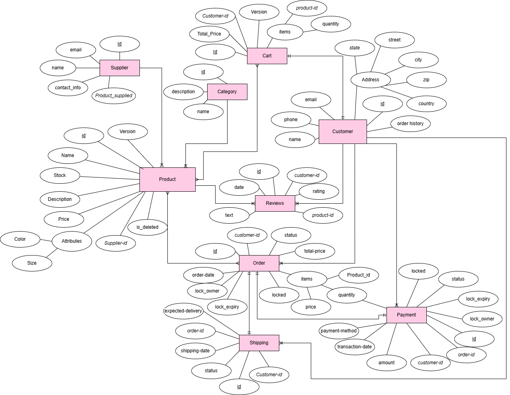

# Ecommerce Inventory and Order Management System

A comprehensive Java Swing desktop application for managing inventory, orders, customers, suppliers, payments, shipping, and customer reviews. Built with MongoDB for persistent data storage and designed to run seamlessly in **NetBeans IDE**.

## 🎯 Overview

This project provides a complete business management solution for e-commerce operations, featuring an intuitive graphical interface for managing products, inventory levels, customer information, order processing, and supplier relationships. The application generates real-time charts and statistics for business insights.

## ✨ Features

- **Product & Inventory Management** – Add, update, and track product inventory with stock levels
- **Order Management** – Create, track, and manage customer orders with order status
- **Customer Management** – Maintain customer profiles, contact information, and history
- **Supplier Management** – Manage supplier details and relationships
- **Shipping Management** – Track shipping information and delivery status
- **Payment Processing** – Record and manage payment transactions
- **Customer Reviews** – Collect and manage product reviews and ratings
- **Dashboard & Analytics** – Real-time summary statistics and visual charts for business metrics
- **Database Persistence** – MongoDB-backed storage for reliable data management
- **User Authentication** – Secure login system for application access

## 🛠️ Tech Stack

- **Language:** Java (JDK 17+)
- **UI Framework:** Java Swing
- **Database:** MongoDB
- **Charting:** JFreeChart
- **IDE Support:** NetBeans (Primary), Eclipse, IntelliJ
- **Build System:** NetBeans Ant-based project structure
- **Supporting Scripts:** Python utilities for backend operations

## 📁 Project Structure

```
InventoryManagementSystem/
├── InventoryManagementSystem/
│   ├── src/inventorymanagementsystem/    # Main Java application source code
│   ├── build/                            # Compiled classes directory
│   ├── nbproject/                        # NetBeans project configuration
│   └── build.xml                         # Ant build file
├── Libraries/                            # Required JAR dependencies
├── Python code/                          # Python utility scripts
│   ├── CartService.py
│   ├── ProductsService.py
│   ├── Order_Cancellation.py
│   └── Place_order.py
├── erd/                                  # Entity Relationship Diagram
│   └── Ecom-invent.drawio
└── README.md
```

## 📋 Prerequisites

- **Java Development Kit (JDK)** – Version 17 or later
- **NetBeans IDE** – Version 12.0 or later (recommended for development)
- **MongoDB Server** – Running locally on port 27017 (or remote instance configured)
- **Git** – For cloning the repository

## ⚙️ Installation & Setup

### 1. Clone the Repository

```bash
git clone https://github.com/RameeshaAkram/Ecommerce-Inventory-and-Order-Management-System.git
cd ecom
```

### 2. Open in NetBeans (Recommended)

1. Launch **NetBeans IDE**
2. Go to **File → Open Project**
3. Navigate to `InventoryManagementSystem/InventoryManagementSystem/` folder
4. Click **Open Project**
5. NetBeans will automatically detect and load the project configuration
6. The required libraries from the `Libraries/` folder will be added to the classpath

### 3. Configure MongoDB

Ensure MongoDB is running on your system. By default, the application connects to:
- **URI:** `mongodb://localhost:27017`
- **Database:** `EcommerceInventoryManagment`

To use a different MongoDB instance, set environment variables or modify the connection in `MongoConfig.java`

## 🚀 Running the Application

### Option 1: NetBeans IDE (Recommended)

1. Open the project in NetBeans (see Installation & Setup section)
2. Right-click on the project in the **Projects** panel
3. Select **Run** or press `F6`
4. The Login window will appear – enter your credentials

### Option 2: Command Line

#### Linux/macOS:

```bash
cd InventoryManagementSystem/InventoryManagementSystem
javac -cp "../Libraries/*" -d build/classes $(find src -name "*.java")
java -cp "build/classes:../Libraries/*" inventorymanagementsystem.Login
```

#### Windows PowerShell:

```powershell
cd InventoryManagementSystem\InventoryManagementSystem
$cp = "..\Libraries\*"
$files = Get-ChildItem -Path .\src -Recurse -Filter *.java | ForEach-Object { $_.FullName }
javac -cp $cp -d .\build\classes $files
java -cp ".\build\classes;$cp" inventorymanagementsystem.Login
```

## 🗄️ MongoDB Configuration

### Connection Details

The application uses the following default MongoDB configuration:

```properties
URI: mongodb://localhost:27017
Database: EcommerceInventoryManagment
```

### Custom Configuration

To connect to a different MongoDB instance, set environment variables:

```bash
# Linux/macOS
export MONGO_URI="mongodb://your-server:27017"
export MONGO_DATABASE="YourDatabaseName"

# Windows PowerShell
$env:MONGO_URI="mongodb://your-server:27017"
$env:MONGO_DATABASE="YourDatabaseName"
```

Alternatively, modify the connection settings directly in `MongoConfig.java`

## 🎓 Application Entry Points

The main application classes:

| Class | Purpose |
|-------|---------|
| `Login.java` | User authentication and login interface |
| `MenuPage.java` | Main application dashboard |
| `CreateMenu.java` | Interface for creating new records |
| `ReadMenu.java` | View and retrieve existing records |
| `UpdateMenu.java` | Modify existing records |
| `DeleteMenu.java` | Remove records from the database |
| `MongoConfig.java` | MongoDB connection configuration |

## 🐍 Python Utility Scripts

The `Python code/` directory contains supporting scripts:

- **CartService.py** – Shopping cart operations
- **ProductsService.py** – Product management utilities
- **Place_order.py** – Order placement logic
- **Order_Cancellation.py** – Order cancellation handling
- **PesimisticLock.py** – Concurrency control for inventory

These scripts can be used as backend services or utilities alongside the Java application.

## 📊 Database Schema

The project includes a comprehensive Entity Relationship Diagram (ERD) that illustrates all database relationships:



**Key Entities:**
- **Product** – Core product information with inventory tracking
- **Customer** – Customer profiles and contact details
- **Cart** – Shopping cart for order composition
- **Order** – Order details with status and pricing
- **Payment** – Payment records with transaction details
- **Shipping** – Shipment tracking and delivery information
- **Reviews** – Customer product reviews and ratings
- **Supplier** – Supplier information and relationships
- **Category** – Product categorization
- **Address** – Customer and shipping address management

The ERD source file (`Ecom-invent.drawio`) can be edited in [draw.io](https://draw.io) or any DrawIO-compatible application.

## 🔐 Security Notes

- The application implements user authentication for secure access
- Hardcoded credentials have been removed from the codebase for security
- Sensitive configuration (database credentials) should be set via environment variables
- The project is suitable for production deployment with proper security hardening

## 🐛 Troubleshooting

**MongoDB Connection Failed**
- Ensure MongoDB is running: `mongod --version`
- Check the connection URI and port (default: 27017)
- Verify MongoDB is accessible from your machine

**NetBeans Cannot Find Libraries**
- Right-click project → **Properties → Libraries**
- Add JAR files from the `Libraries/` folder manually if needed

**"Class Not Found" Error**
- Ensure all JAR files in `Libraries/` are on the classpath
- In NetBeans, rebuild the project: **Clean & Build**

**Database Not Found**
- MongoDB will automatically create the database on first connection
- Verify the database name matches your configuration

## 📝 Notes

- The project was cleaned and refactored to be portable and secure for GitHub publishing
- Hardcoded cloud credentials and sensitive data have been removed
- Full NetBeans project configuration is included (`nbproject/` folder)
- The application requires a working MongoDB instance to function
- All dependencies are included in the `Libraries/` folder
- Compatible with Java 17 and later versions

## 🤝 Contributing

Contributions are welcome! Please:

1. Fork the repository
2. Create a feature branch (`git checkout -b feature/improvement`)
3. Commit your changes (`git commit -m 'Add improvement'`)
4. Push to the branch (`git push origin feature/improvement`)
5. Open a Pull Request

## 📄 License

This project is provided for academic, educational, and portfolio use. See LICENSE file for details.

## 👨‍💻 Author

**Ramesha Akram**

GitHub: [RameeshaAkram](https://github.com/RameeshaAkram)

Repository: [Ecommerce-Inventory-and-Order-Management-System](https://github.com/RameeshaAkram/Ecommerce-Inventory-and-Order-Management-System)

## 🙏 Support

If you encounter any issues or have questions, please:

- Open an **Issue** on GitHub
- Review the troubleshooting section above
- Check the NetBeans project configuration
